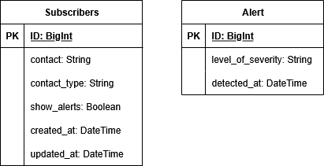

# earthquake-detector

## Essential prerequisites

- Astral UV
- Docker Engine

## How to run the project

1. Install project dependencies
```bash
$ uv run
```

2. Copy `.env.example` into `.env` file 
```bash
$ cp .env.example .env 
```

3. Run `generate_token.py` script
```bash
$ uv run scripts/generate_token.py
```

4. Run containers
```bash
$ docker compose up --build --force-recreate -d
```

## Run migrations

To create migrations run
```bash
$ docker compose app exec uv run manage.py makemigrations
```

To apply migrations run
```bash
$ docker compose app exec uv run manage.py migrate
```

## Run staticfiles

To create staticfiles run
```bash
$ docker compose app exec uv run manage.py collectstatic
```

## Run tests

To run tests do
```bash
$ docker compose app exec uv run manage.py test
```

## To test telegram's bot

During testing, run with polling
```bash
$ docker compose app exec uv run manage.py runbot
```
> Don't forget to set `TELEGRAM_BOT_TOKEN` in `.env`

## Alert's endpoint

To send alerts to subscribers, use the following endpoint:
```
POST /alerts/webhook/
```

The payload should be in JSON format and include the following fields:
- `level`: An string representing the alert level ("High" or "Low").
- `detected_at`: A timestamp in ISO 8601 format indicating when the alert was detected.

Example payload:
```json
{
    "level": "High",
    "detected_at": "2023-10-01T12:34:56"
}
```

## Entity Diagram

